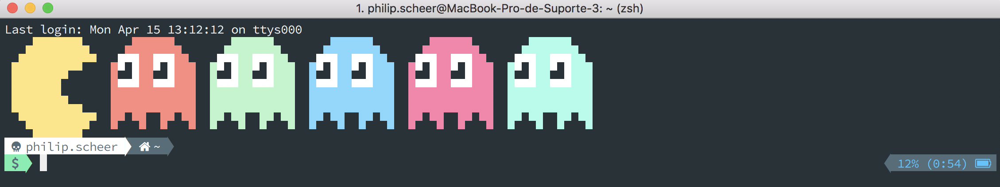

# Custom zsh




**Resources**

- [Theme Material Design](material-design-colors.itermcolors)
- [Font Meslo LG L DZ Regular Nerd Font Complete](Meslo_LG_L_DZ_Regular_Nerd_Font_Complete.otf)
- [Source Code Pro Powerline Awesome Regular](SourceCodePro+Powerline+Awesome+Regular.ttf)
- [Source Code Pro for Powerline](Source_Code_Pro_for_Powerline.otf)


**Install**

```
brew cask install iterm2
sh -c "$(curl -fsSL https://raw.github.com/robbyrussell/oh-my-zsh/master/tools/install.sh)"
git clone https://github.com/bhilburn/powerlevel9k.git ~/.oh-my-zsh/custom/themes/powerlevel9k
brew install zsh-syntax-highlighting
brew install neofetch
brew install fontforge
```

### References
--------------

- [Andrea's config](https://github.com/bhilburn/powerlevel9k/wiki/Show-Off-Your-Config#andreas-config)
- [zsh-syntax-highlighting](https://github.com/zsh-users/zsh-syntax-highlighting)
- [dotfiles by andrea](https://github.com/da-edra/dotfiles)
- [zsh-users](https://github.com/zsh-users)
- [iterm2-solarized](https://gist.github.com/kevin-smets/8568070)
